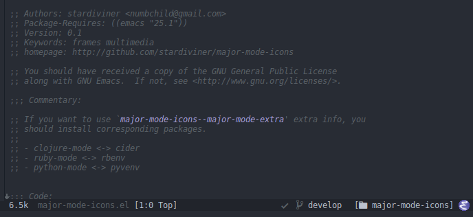

# major-mode-icons

Show major-mode with icons on mode-line.

# Screenshot



# Features

- support many programming languages
- support show extra of some modes like: Clojure, Ruby, Python etc.
- only show icon for current selected window, otherwise show mode name.

# Usage

If you use `use-package`:

```elisp
(use-package major-mode-icons
  :ensure t
  :config
  (major-mode-icons-mode 1))
```

## mode :lighter

Minor mode `major-mode-icons-mode` has a `:lighter` support.

## user custom mode-line

If you use a customize mode-line:

```elisp
(setq
 mode-line-end-spaces
 (quote
  ((:eval
    (major-mode-icons/show))
    )))
```

## powerline

Also suppoer powerline with segment name `powerline-major-mode-icons`.

